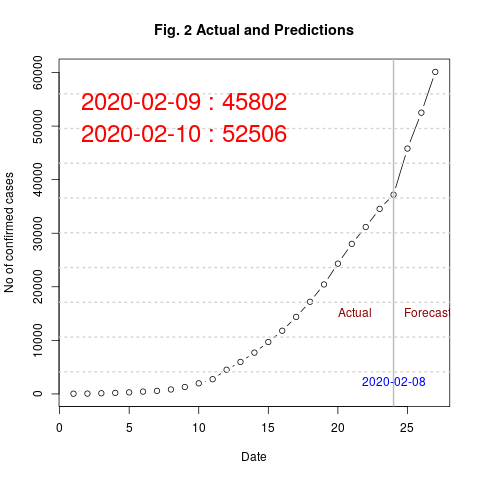

# Wuhan Coronavirus Epidemic
As the number of infected cases and deaths keep rising, a statistical perspective on the spread of the coronavirus epidemic is needed. This repo presents the modeling tool to make daily prediction. My goal is to make a daily update of the model as new data become available. Epidemiological studies on the 2003 SARS epidemic can be found in [1], [2], and [3]. A discussion of the standard models can be found in [4].

#### Update (Feb 1) 
*Observation* : Actual has been consistently lower than model prediction. See Fig X.  

*What it means* : The spread of the coronavirus is *_slower_* than what an exponential model would predict. 

*Implications* : The lock-down in Wuhan and other cities seem to be working in containing the contagion. 

It's way too early to predict the peak level and its timing, but things don't look as bleak as before.

### Data Sources
The official source of data is from 中华人民共和国国家卫生健康委员会 (National Health Commission of the PRC) or 卫健委.

http://www.nhc.gov.cn/xcs/yqtb/list_gzbd.shtml

I use the summary table from [Wiki](https://en.wikipedia.org/wiki/Timeline_of_the_2019%E2%80%9320_Wuhan_coronavirus_outbreak).

A nice visualization can be found [here](https://gisanddata.maps.arcgis.com/apps/opsdashboard/index.html#/bda7594740fd40299423467b48e9ecf6).

I capture the Wiki table and save it in `corona_data.csv`, which could be read into R. 

### Model

I use a simplified version of the SIR model, which is a standard formulation of disease transmission dynamics[4]. In a SIR model, we track the time progression of three populations, namely, the susceptible, denoted by the variable S, the infective, or the variable I, and the removed, or R. If a person is healthy and has not contracted the epidemic, he/she belongs to class S. A sick person is in I, while the class R includes both the dead and those who have recovered from and thus are immune to the disease.

The three state variables obey the following coupled non-linear differential equations,

 

where  are the parameters of the model, t a discrete time index, and the state variables are fraction of the total population so that .

We could make a simplifying assumption in the case of Wuhan. Since the population in question is large, the impact of the infection is insignificant relative to the size of the population. In a country of 1.4 billion, the current number of deaths from coronavirus is not even 0.01 percent of the population. Therefore, , and . We could drop Equation (1) and (3), and Equ (2) becomes,

 

where I define .

By elementary calculus Equ (4) has solution

 

The rest is to fit this exponential function to the daily data. I use non-linear least squares in `R`. For coding details please consult `coronavirus.R`.

### Results
This is the latest model prediction on the number of confirmed cases. The actual figures are usually released at around 16:00 PST. 

Beta, or the rate of infection is dropping, as could be seen in the left plot below.

### Interpretation
Although the number of infected cases continue to rise, the rate of increase has been steadily declining. This is a sign that the lock-down is working.

### Generate Prediction
Open `corona_data.csv` with your favorite spreadsheet, e.g. Excel. Read off the latest statistics from [Wiki](https://en.wikipedia.org/wiki/Timeline_of_the_2019%E2%80%9320_Wuhan_coronavirus_outbreak) and enter them in last row.

Open a terminal, 

    Rscript coronavirus.R

After the script finishes, two files are generated : `latest-prediction.png` in the top directory, and `Beta-history.png` in subdirectory plots/. 

### Install Software
To install R, press Ctrl+Alt+T to open a terminal

    sudo apt-get update 
    sudo apt-get install r-base

### Dependencies
Code has been tested on 
* R 3.6.0
* Ubuntu 18.04 

### Contact
To ask questions or report issues, please open an issue on the [issues tracker](https://github.com/htso/Coronavirus_Epidemic/issues).

References

[1] Dye, C., & Gay, N. (2003). Modeling the SARS epidemic. Science, 300(5627), 1884-1885.

[2] Brauer, F. (2006). Some simple epidemic models. Mathematical Biosciences & Engineering, 3(1), 1.

[3] Naheed, A., Singh, M., & Lucy, D. (2014). Numerical study of SARS epidemic model with the inclusion of diffusion in the system. Applied Mathematics and computation, 229, 480-498.

[4] Newman, M. E. (2002). Spread of epidemic disease on networks. Physical review E, 66(1), 016128.

